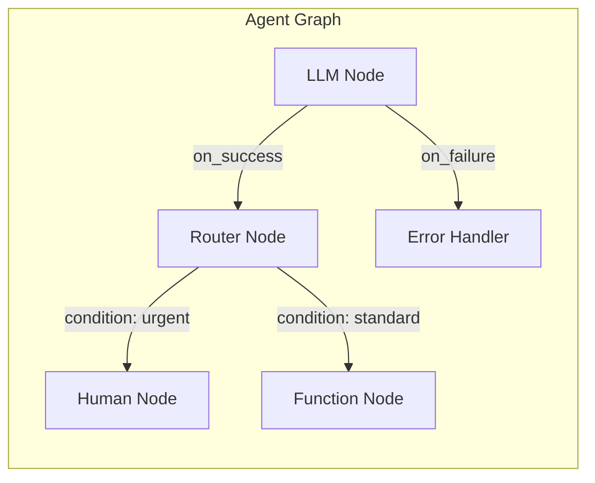

## Agent Graph Overview

Every Aden agent is represented as a directed graph consisting of:

- **Nodes** - Individual processing units (LLM calls, routers, functions, human intervention)
- **Edges** - Connections between nodes that define flow (success, failure, conditional)
- **Context** - Shared state passed between nodes (memory, tools, LLM access)



## Node Types

### LLM Node

Executes a language model call with a prompt template and context.

```python
{
  "type": "llm",
  "name": "analyze_request",
  "model": "claude-sonnet-4-5-20250929",
  "prompt": "Analyze this customer request: {{input}}",
  "output_schema": {...}
}
```

**Capabilities:**
- Structured output via JSON schema
- Tool/function calling
- Streaming responses
- Automatic retry with backoff

### Router Node

Routes execution to different paths based on conditions or LLM decisions.

```python
{
  "type": "router",
  "name": "urgency_router",
  "conditions": [
    {"path": "urgent_handler", "when": "urgency == 'high'"},
    {"path": "standard_handler", "when": "urgency == 'low'"},
    {"path": "review_handler", "default": true}
  ]
}
```

**Routing Strategies:**
- **Conditional** - Based on output values
- **LLM-decided** - Let the model choose the path
- **Weighted** - Probabilistic routing for A/B testing

### Function Node

Executes custom Python code for business logic, API calls, or data transformation.

```python
{
  "type": "function",
  "name": "send_email",
  "handler": "tools.send_email",
  "inputs": ["recipient", "subject", "body"]
}
```

### Human-in-the-Loop Node

Pauses execution for human input with configurable timeouts and escalation.

```python
{
  "type": "human",
  "name": "manager_approval",
  "prompt": "Approve refund of ${{amount}}?",
  "timeout": "24h",
  "escalation": "auto_reject"
}
```

See [Human-in-the-Loop](/building/human-in-the-loop) for details.

## Edge Types

Edges connect nodes and define the execution flow:

| Edge Type | Description | Example |
|-----------|-------------|---------|
| `on_success` | Execute when node completes successfully | LLM response received |
| `on_failure` | Execute when node fails | API error, timeout |
| `conditional` | Execute based on output conditions | `when: "score > 0.8"` |

```python
{
  "edges": [
    {"from": "analyze", "to": "approve", "type": "on_success"},
    {"from": "analyze", "to": "retry", "type": "on_failure"},
    {"from": "router", "to": "path_a", "when": "category == 'A'"},
    {"from": "router", "to": "path_b", "when": "category == 'B'"}
  ]
}
```

## SDK-Wrapped Nodes

Every node in Aden is wrapped with the SDK, providing:

<CardGroup cols={2}>
  <Card title="Shared Memory" icon="database">
    Access to global and local memory stores
  </Card>
  <Card title="LLM Access" icon="brain">
    Built-in access to configured LLM providers
  </Card>
  <Card title="Tool Registry" icon="wrench">
    Access to MCP tools and custom functions
  </Card>
  <Card title="Observability" icon="chart-line">
    Automatic logging, tracing, and cost tracking
  </Card>
</CardGroup>

## Node Context

Each node receives a context object with:

```python
class NodeContext:
    memory: MemoryStore      # Shared memory across nodes
    llm: LLMClient           # Configured LLM client
    tools: ToolRegistry      # Available tools
    input: dict              # Input from previous node
    metadata: dict           # Run metadata (trace_id, etc.)
```

## Agent Specification

Agents are defined in a JSON specification (`agent.json`):

```json
{
  "name": "support-agent",
  "version": "1.0.0",
  "goal": "Handle customer support tickets efficiently",
  "nodes": [...],
  "edges": [...],
  "config": {
    "default_model": "claude-sonnet-4-5-20250929",
    "timeout": "5m",
    "max_retries": 3
  }
}
```

## Next Steps

<CardGroup cols={2}>
  <Card title="Agent Graph" icon="project-diagram" href="/building-agent/concepts/agent-graph">
    Dive into graph execution, routing patterns, and shared memory behavior
  </Card>
  <Card title="Worker Agent" icon="robot" href="/building-agent/concepts/worker-agent">
    Understand sessions, iterations, and headless runtime operations
  </Card>
  <Card title="Build Your First Agent" icon="hammer" href="/building/first-agent">
    Create an agent from scratch
  </Card>
  <Card title="Node Reference" icon="cube" href="/building/nodes">
    Detailed node configuration options
  </Card>
</CardGroup>
