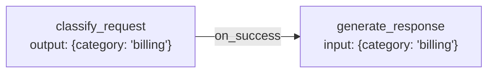
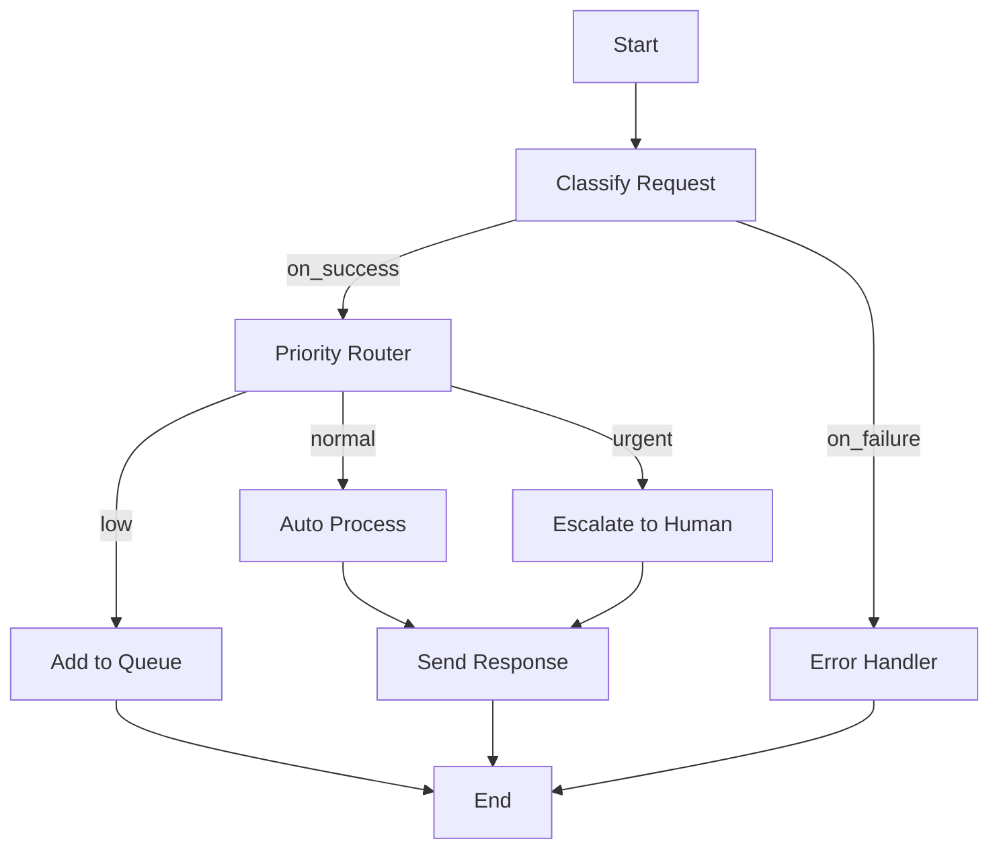

## Overview

Edges define how execution flows between nodes in your agent graph. Unlike traditional frameworks that hardcode workflows, Aden's edges are dynamically generated based on your goals.

## Edge Types

| Type | Trigger | Use Case |
|------|---------|----------|
| `on_success` | Node completes successfully | Normal flow progression |
| `on_failure` | Node throws an error | Error handling, retries |
| `conditional` | Output matches a condition | Branching logic |

## Basic Syntax

```json
{
  "edges": [
    {"from": "node_a", "to": "node_b", "type": "on_success"},
    {"from": "node_a", "to": "error_handler", "type": "on_failure"},
    {"from": "router", "to": "path_a", "when": "category == 'A'"},
    {"from": "router", "to": "path_b", "when": "category == 'B'"}
  ]
}
```

## Success Edges

Execute the next node when the current node completes without errors.

```json
{
  "from": "classify_request",
  "to": "generate_response",
  "type": "on_success"
}
```

### Passing Data

Output from the source node becomes input for the target:



## Failure Edges

Execute when a node throws an error or times out.

```json
{
  "from": "api_call",
  "to": "retry_handler",
  "type": "on_failure"
}
```

### Error Context

Failed nodes pass error information:

```python
{
  "error": {
    "type": "TimeoutError",
    "message": "Request timed out after 30s",
    "node_id": "api_call",
    "attempt": 1
  },
  "original_input": {...}
}
```

### Retry Pattern

```json
{
  "nodes": [
    {
      "id": "api_call",
      "type": "function",
      "handler": "tools.external_api"
    },
    {
      "id": "retry_handler",
      "type": "function",
      "handler": "tools.retry_with_backoff",
      "config": {"max_attempts": 3, "backoff": "exponential"}
    }
  ],
  "edges": [
    {"from": "api_call", "to": "next_step", "type": "on_success"},
    {"from": "api_call", "to": "retry_handler", "type": "on_failure"},
    {"from": "retry_handler", "to": "api_call", "type": "on_success"},
    {"from": "retry_handler", "to": "fallback", "type": "on_failure"}
  ]
}
```

## Conditional Edges

Route based on output values using expressions.

```json
{
  "from": "sentiment_analysis",
  "to": "escalate",
  "when": "sentiment == 'negative' && confidence > 0.8"
}
```

### Expression Syntax

| Operator | Description | Example |
|----------|-------------|---------|
| `==` | Equals | `status == 'approved'` |
| `NOT_EQUAL` | Not equals | `type NOT_EQUAL 'spam'` |
| `>`, `<`, `>=`, `<=` | Comparison | `score >= 0.7` |
| `&&` | Logical AND | `type == 'urgent' && priority > 5` |
| `\|\|` | Logical OR | `status == 'error' OR retries > 3` |
| `in` | Contains | `category in ['billing', 'sales']` |

### Accessing Nested Values

```json
{
  "when": "response.metadata.confidence > 0.9"
}
```

## Multiple Outgoing Edges

A node can have multiple outgoing edges:

```json
{
  "edges": [
    {"from": "analyze", "to": "approve", "when": "risk == 'low'"},
    {"from": "analyze", "to": "review", "when": "risk == 'medium'"},
    {"from": "analyze", "to": "reject", "when": "risk == 'high'"},
    {"from": "analyze", "to": "error_handler", "type": "on_failure"}
  ]
}
```

### Default Path

Use a default edge when no conditions match:

```json
{
  "edges": [
    {"from": "router", "to": "path_a", "when": "type == 'A'"},
    {"from": "router", "to": "path_b", "when": "type == 'B'"},
    {"from": "router", "to": "default_handler", "default": true}
  ]
}
```

## Parallel Execution

Execute multiple nodes in parallel by having multiple success edges:

```json
{
  "edges": [
    {"from": "start", "to": "task_a", "type": "on_success", "parallel": true},
    {"from": "start", "to": "task_b", "type": "on_success", "parallel": true},
    {"from": "start", "to": "task_c", "type": "on_success", "parallel": true},
    {"from": ["task_a", "task_b", "task_c"], "to": "aggregate", "type": "on_all_success"}
  ]
}
```

### Join Strategies

| Strategy | Description |
|----------|-------------|
| `on_all_success` | Wait for all parallel nodes to succeed |
| `on_any_success` | Continue when first node succeeds |
| `on_all_complete` | Wait for all to complete (success or failure) |

## Edge Transformation

Transform data between nodes:

```json
{
  "from": "extract_entities",
  "to": "validate_entities",
  "type": "on_success",
  "transform": {
    "entities": "$.output.entities",
    "source_document": "$.input.document_id"
  }
}
```

## Visualization

Your agent graph can be visualized:



## Next Steps

<CardGroup cols={2}>
  <Card title="Human-in-the-Loop" icon="user" href="/building/human-in-the-loop">
    Add human intervention points to your graph
  </Card>
  <Card title="Testing Agents" icon="vial" href="/building/testing">
    Test your agent's edge behavior
  </Card>
</CardGroup>
