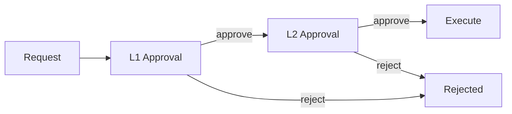

## Overview

Human-in-the-loop (HITL) nodes pause agent execution to collect human input. This enables:

- **Approvals** - High-stakes decisions requiring human sign-off
- **Escalation** - Complex cases beyond agent capabilities
- **Quality Control** - Spot-checking agent outputs
- **Training Data** - Collecting human feedback for improvement

## Basic Configuration

```json
{
  "id": "approval_gate",
  "type": "human",
  "prompt": "Review and approve this action: {{action_description}}",
  "options": ["approve", "reject", "modify"],
  "timeout": "24h",
  "escalation": "auto_reject"
}
```

## Parameters

| Parameter | Type | Required | Description |
|-----------|------|----------|-------------|
| `prompt` | string | Yes | Instructions/question for the human |
| `options` | array | No | Predefined response choices |
| `timeout` | string | No | Time limit (e.g., "1h", "24h", "7d") |
| `escalation` | string | No | Timeout action: `auto_approve`, `auto_reject`, `escalate`, `retry` |
| `assignee` | string | No | User, role, or team to notify |
| `priority` | string | No | `low`, `medium`, `high`, `urgent` |
| `context` | object | No | Additional context to display |

## Approval Patterns

### Simple Approval

Binary approve/reject for high-stakes decisions:

```json
{
  "id": "manager_approval",
  "type": "human",
  "prompt": "Approve refund of ${{amount}} for customer {{customer_name}}?",
  "options": ["approve", "reject"],
  "timeout": "4h",
  "escalation": "escalate",
  "assignee": "role:manager"
}
```

### Multi-Level Approval

Chain multiple approval steps:



```json
{
  "nodes": [
    {
      "id": "l1_approval",
      "type": "human",
      "prompt": "L1 Review: {{request}}",
      "assignee": "role:l1_approver",
      "timeout": "8h"
    },
    {
      "id": "l2_approval",
      "type": "human",
      "prompt": "L2 Final Approval: {{request}}",
      "assignee": "role:l2_approver",
      "timeout": "24h"
    }
  ]
}
```

## Escalation Patterns

### Confidence-Based Escalation

Escalate when agent confidence is low:

```json
{
  "nodes": [
    {
      "id": "generate_response",
      "type": "llm",
      "output_schema": {
        "properties": {
          "response": {"type": "string"},
          "confidence": {"type": "number"}
        }
      }
    },
    {
      "id": "human_review",
      "type": "human",
      "prompt": "Agent response (confidence: {{confidence}}):\n\n{{response}}\n\nApprove or edit?",
      "options": ["approve", "edit"]
    }
  ],
  "edges": [
    {"from": "generate_response", "to": "send_response", "when": "confidence >= 0.8"},
    {"from": "generate_response", "to": "human_review", "when": "confidence < 0.8"}
  ]
}
```

### Exception-Based Escalation

Escalate specific scenarios:

```json
{
  "edges": [
    {"from": "process_request", "to": "human_review", "when": "amount > 10000"},
    {"from": "process_request", "to": "human_review", "when": "customer.is_vip == true"},
    {"from": "process_request", "to": "human_review", "when": "risk_score > 0.7"}
  ]
}
```

## Timeout Handling

Configure what happens when humans don't respond:

| Escalation Action | Behavior |
|-------------------|----------|
| `auto_approve` | Automatically approve and continue |
| `auto_reject` | Automatically reject and stop |
| `escalate` | Notify next level / manager |
| `retry` | Resend notification |
| `queue` | Move to low-priority queue |

### Escalation Chain

```json
{
  "id": "urgent_approval",
  "type": "human",
  "prompt": "Urgent: Approve {{action}}",
  "timeout": "1h",
  "escalation": {
    "action": "escalate",
    "to": "role:senior_manager",
    "timeout": "4h",
    "final_action": "auto_reject"
  }
}
```

## Context and Display

Provide rich context for human reviewers:

```json
{
  "id": "fraud_review",
  "type": "human",
  "prompt": "Review potential fraud case",
  "context": {
    "transaction": {
      "amount": "{{amount}}",
      "merchant": "{{merchant}}",
      "location": "{{location}}"
    },
    "risk_factors": "{{risk_factors}}",
    "customer_history": "{{customer_history}}",
    "similar_cases": "{{similar_cases}}"
  },
  "display": {
    "layout": "side-by-side",
    "highlight": ["risk_factors"]
  }
}
```

## Response Handling

### Structured Responses

Collect structured data from humans:

```json
{
  "id": "quality_review",
  "type": "human",
  "prompt": "Rate this response",
  "response_schema": {
    "type": "object",
    "properties": {
      "approved": {"type": "boolean"},
      "quality_score": {"type": "integer", "minimum": 1, "maximum": 5},
      "feedback": {"type": "string"},
      "corrections": {"type": "string"}
    },
    "required": ["approved", "quality_score"]
  }
}
```

### Response-Based Routing

Route based on human response:

```json
{
  "edges": [
    {"from": "human_review", "to": "execute", "when": "response.approved == true"},
    {"from": "human_review", "to": "revise", "when": "response.approved == false && response.corrections"},
    {"from": "human_review", "to": "reject", "when": "response.approved == false && response.corrections == null"}
  ]
}
```

## Assignment Strategies

### Role-Based Assignment

```json
{
  "assignee": "role:customer_support"
}
```

### Round-Robin

```json
{
  "assignee": {
    "strategy": "round_robin",
    "pool": ["user:alice", "user:bob", "user:charlie"]
  }
}
```

### Load-Based

```json
{
  "assignee": {
    "strategy": "least_busy",
    "pool": "team:support"
  }
}
```

## Best Practices

<CardGroup cols={2}>
  <Card title="Clear Prompts" icon="message">
    Provide all context needed for the human to make a decision
  </Card>
  <Card title="Reasonable Timeouts" icon="clock">
    Set timeouts based on urgency and expected response time
  </Card>
  <Card title="Graceful Escalation" icon="arrow-up">
    Always have a fallback when humans don't respond
  </Card>
  <Card title="Feedback Loops" icon="arrows-rotate">
    Use human responses to improve agent performance over time
  </Card>
</CardGroup>

## Next Steps

<CardGroup cols={2}>
  <Card title="Testing Agents" icon="vial" href="/building/testing">
    Test HITL workflows with mock responses
  </Card>
  <Card title="Node Types" icon="cube" href="/building/nodes">
    Learn about other node types
  </Card>
</CardGroup>
