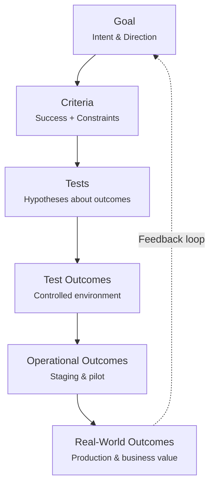
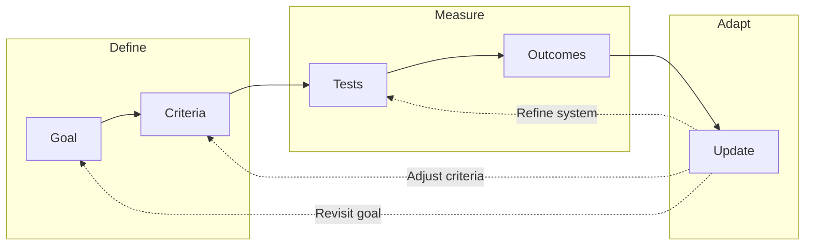

## What is Outcome-Driven Development?

Outcome-driven development is a methodology where you define what success looks like, generate tests as hypotheses, and observe real outcomes at every stage. Unlike traditional approaches that focus on implementation details, ODD keeps you anchored to measurable results.

The key insight: **tests produce outcomes, but they are experimental outcomes whose validity is bounded by the test context.**

## The Progression: From Intent to Outcomes



### 1. Start with a Goal

A goal is **intent, direction, and preference**. No outcomes yet - only what you want to achieve.

```
"Build an agent that resolves Tier-1 support tickets reliably."
```

At this stage, you have expressed direction but haven't defined what success means or observed any results.

### 2. Define Criteria

Criteria translate intent into **what winning would look like**. They set expectations but still aren't outcomes.

| Criteria Type | Example |
|---------------|---------|
| **Success Metric** | Resolution rate of 60% or higher |
| **Quality Constraint** | Hallucination rate below 5% |
| **Cost Constraint** | Less than $0.20 per ticket |
| **Time Constraint** | Response within 30 seconds |

Criteria are expectations - measurable thresholds that define success and failure.

### 3. Generate Tests

Tests are **hypotheses about outcomes**. Each test implicitly says:

> "If the system behaves correctly, outcome X should occur under condition Y."

Tests are measurement instruments, not outcomes themselves. They encode your assumptions about what correct behavior looks like.

```python
# This is a hypothesis, not yet an outcome
def test_common_question_resolution():
    """Agent should resolve common billing questions without escalation."""
    result = agent.run({"question": "How do I update my payment method?"})
    assert result.resolved == True
    assert result.escalated == False
```

### 4. Run Tests → Observe Outcomes

When you run tests, you finally have **outcomes**. But be precise about what kind:

These are **observed outcomes in a controlled environment**.

| What You Observe | Example |
|------------------|---------|
| Pass/fail rates | 47/50 tests passing |
| Error modes | Timeout on complex queries |
| Latency | P95 at 2.3 seconds |
| Tool misuse | Called wrong API 3 times |
| Hallucinations | 2 cases from edge prompts |

**Why these are outcomes:** Something actually happened. The system interacted with inputs. Effects were observed, not imagined.

**Why they're limited:** They don't yet tell you whether users trust the agent, whether it reduces real workload, or whether edge cases in the wild dominate behavior.

## The Outcome Taxonomy

All results are outcomes - they differ by **context and validity**, not by kind.

| Stage | What You Observe | Outcome Type |
|-------|------------------|--------------|
| **Tests** | Pass/fail, errors, timings | Test outcomes |
| **Staging / Pilot** | Task completion, escalations, user feedback | Operational outcomes |
| **Production** | Behavior change, value created, business impact | Real-world outcomes |

### Test Outcomes

Controlled environment. Known inputs. Repeatable conditions.

- High internal validity
- Limited external validity
- Fast feedback loop
- Low cost to observe

### Operational Outcomes

Real users in limited deployment. Shadow mode or pilot groups.

- Moderate internal validity
- Growing external validity
- Reveals integration issues
- Surface unexpected edge cases

### Real-World Outcomes

Full production. Business metrics. User trust.

- Full external validity
- Highest signal quality
- Slowest feedback loop
- Highest cost to observe

## The Feedback Loop

Outcome-driven development depends on closing the loop:



Outcomes inform updates at every level:

- **Update the system** - Fix bugs, improve prompts, add guardrails
- **Adjust criteria** - Thresholds may be too strict or too lenient
- **Revisit the goal** - Sometimes the original intent was wrong

## Example: Support Agent Development

### Phase 1: Define

**Goal:**
```
Build an agent that handles Tier-1 support tickets reliably.
```

**Criteria:**
- Resolution rate: 60%+
- Hallucination rate: less than 5%
- Cost per ticket: less than $0.20
- Escalation accuracy: 90%+

### Phase 2: Test Outcomes

Run automated tests against synthetic tickets:

| Metric | Result | Status |
|--------|--------|--------|
| Resolution rate | 52% | Below target |
| Hallucination rate | 3% | Passing |
| Cost per ticket | $0.18 | Passing |
| Escalation accuracy | 87% | Below target |

**Insight:** Resolution and escalation need work. Adjust prompts, add examples.

### Phase 3: Operational Outcomes

Deploy to 5% of traffic in shadow mode:

| Metric | Result | Insight |
|--------|--------|---------|
| Resolution rate | 58% | Closer to target |
| User satisfaction | 3.8/5 | New signal |
| Edge case failures | 12 types | Unexpected patterns |

**Insight:** Real traffic reveals edge cases tests missed. Update test suite.

### Phase 4: Real-World Outcomes

Full production deployment:

| Metric | Result | Business Impact |
|--------|--------|-----------------|
| Resolution rate | 63% | Target exceeded |
| Support cost reduction | 34% | Direct savings |
| Customer satisfaction | +12 NPS | Trust building |

## Best Practices

<CardGroup cols={2}>
  <Card title="Distinguish Outcome Types" icon="layer-group">
    Know whether you're looking at test, operational, or real-world outcomes
  </Card>
  <Card title="Close the Loop" icon="arrows-rotate">
    Every outcome should inform an update - to system, criteria, or goal
  </Card>
  <Card title="Progress Through Stages" icon="stairs">
    Don't skip from test outcomes to production - operational outcomes catch issues
  </Card>
  <Card title="Measure What Matters" icon="bullseye">
    Business outcomes matter most, but test outcomes give fastest feedback
  </Card>
</CardGroup>

## Next Steps

<CardGroup cols={2}>
  <Card title="Agent Architecture" icon="sitemap" href="/concepts/agent-architecture">
    Learn about nodes, edges, and the agent graph structure
  </Card>
  <Card title="Build Your First Agent" icon="hammer" href="/building/first-agent">
    Create your first outcome-driven agent
  </Card>
</CardGroup>
