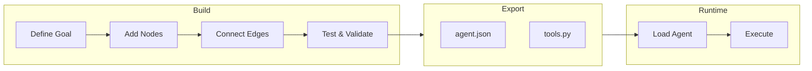

## Overview

Aden is a platform for building, deploying, and adapting AI agents. Define your goal through conversation with a coding agent, and the framework generates a node graph with dynamically created connection code. When things break, the framework captures failure data, evolves the agent through the coding agent, and redeploys.

<CardGroup cols={2}>
  <Card title="Build" icon="hammer">
    A Coding Agent generates specialized Worker Agents (Sales, Marketing, Ops) from natural language goals
  </Card>
  <Card title="Deploy" icon="rocket">
    Headless deployment with CI/CD integration and full API lifecycle management
  </Card>
  <Card title="Adapt" icon="arrows-rotate">
    Continuous evaluation, supervision, and adaptation ensure agents improve over time
  </Card>
  <Card title="Infrastructure" icon="server">
    Shared memory, LLM integrations, tools, and skills power every agent
  </Card>
</CardGroup>

## The Aden Advantage

| Traditional Frameworks | Aden |
|------------------------|------|
| Hardcode agent workflows | Describe goals in natural language |
| Manual graph definition | Auto-generated agent graphs |
| Reactive error handling | Proactive self-evolution |
| Static tool configurations | Dynamic SDK-wrapped nodes |
| DIY budget management | Integrated cost controls |

## How It Works

1. **Define Your Goal** - Describe what you want to achieve in plain English
2. **Coding Agent Generates** - Creates the agent graph, connection code, and test cases
3. **Workers Execute** - SDK-wrapped nodes run with full observability and tool access
4. **Self-Improve** - On failure, the system evolves the graph and redeploys automatically

## When to Choose Aden

Choose Aden when you need:

- Agents that **self-improve from failures** without manual intervention
- **Goal-driven development** where you describe outcomes, not workflows
- **Production reliability** with automatic recovery and redeployment
- **Rapid iteration** on agent architectures without rewriting code
- **Human oversight** with built-in human-in-the-loop capabilities

## Next Steps

<CardGroup cols={2}>
  <Card title="Goal-Driven Development" icon="bullseye" href="/concepts/goal-driven-development">
    Learn how to define agent goals and success criteria
  </Card>
  <Card title="Agent Architecture" icon="sitemap" href="/concepts/agent-architecture">
    Understand nodes, edges, and the agent graph
  </Card>
</CardGroup>
